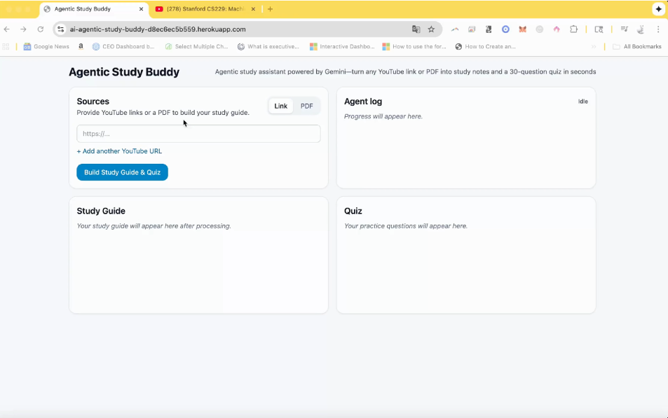

# YouNotes Project Report

## 1. Overview / Problem Statement
Learners often consume long-form educational videos or dense PDF documents (research papers, lecture slides, manuals) without a structured way to extract key ideas, timelines, and practice questions. Manual note‑taking is time‑consuming and inconsistent; generating quizzes requires additional effort. There is a need for an automated study companion that:

- Ingests YouTube videos (with timestamps) and PDFs.
- Produces high–quality, structured study notes and summaries.
- Synthesizes a consolidated guide from multiple sources.
- Generates a sizable quiz (e.g. 30 questions) for active recall.

YouNotes addresses this by providing an AI‑powered pipeline using Google Gemini to transform raw learning materials into actionable study artifacts quickly.

## 2. Objectives
1. Rapid source ingestion (video URLs + PDF upload).
2. Maintain temporal context for YouTube via timestamped summaries.
3. Create a unified study guide merging multiple sources.
4. Auto‑generate a 30‑question quiz for self‑assessment.
5. Provide transparency through a real‑time agent log.
6. Offer a clean, responsive UI usable on desktop.

## 3. System Architecture
```
+-----------------+        +-------------------+        +-----------------------+
|   Frontend      | --->   |   Backend API     | --->   |  Gemini LLM + YouTube |
| React + Vite    |        | Node/Express TS   |        |  Data / PDF Parsing   |
+-----------------+        +-------------------+        +-----------------------+
        |                        |                           |
        |  File Upload / URLs    |                           |
        |----------------------->|  Ingestion Pipeline       |
        |                        |-- Fetch & Parse Sources   |
        |                        |-- Extract Transcript/HTML |
        |                        |-- Summarize & Quiz Gen    |
        |<-----------------------|  Streaming Logs & Results |
```

### Key Backend Components
- `src/routes/youtube.ts`: Endpoint(s) for YouTube ingestion.
- `src/utils/yt_reader.ts` / `yt_reader_strict.ts`: Transcript + metadata retrieval.
- `src/utils/pdf_reader_strict.ts`: PDF content extraction.
- `src/agents/` (planner, summarize, quiz): Orchestrate multi‑step reasoning.
- `src/services/gemini.ts`: Interface with Google Gemini.
- `src/utils/jsonStrict.ts` & `jsonrepair`: Guardrails for structured JSON output.

### Data Flow
1. User submits URLs or a PDF file.
2. Backend fetches/reads each source.
3. Agent planner decides summarization steps; timestamps preserved for videos.
4. Summaries combined into unified guide.
5. Quiz agent generates diverse question set (MCQ / short answer potential).
6. Streamed progress and final guide + quiz returned to client.

## 4. Frontend UI Overview
- `InputPanel`: Collects YouTube URLs and optional PDF file; triggers build.
- `AgentLog`: Streams agent reasoning steps for transparency.
- `GuideView`: Renders structured study guide (sections, bullet points, timestamps).
- `QuizView`: Displays generated quiz items for practice.
- Rebranding: Title updated to **YouNotes** for consistent product identity.

### Screenshots



## 5. Technologies Used
| Layer        | Stack / Tools |
|--------------|---------------|
| Frontend     | React 18, Vite, TypeScript, Tailwind CSS |
| Backend      | Node.js, Express, TypeScript |
| AI / LLM     | Google Gemini 2.5 Flash |
| Parsing      | JSDOM + Readability (YouTube page / HTML), pdfjs-dist |
| Robust JSON  | Zod validation, jsonrepair, strict JSON parsing helpers |
| Infra        | Docker (multi-stage build), Heroku container deployment |

## 6. Implementation Highlights
### Multi‑Stage Dockerfile
Builds client, server TypeScript, installs production dependencies for minimal runtime image.

### Strict JSON Handling
LLM output is passed through `jsonStrict.ts` and `jsonrepair` to reduce malformed structure issues.

### Timestamps Preservation
YouTube transcript parser annotates summaries allowing quick navigation back to source content.

### Quiz Generation Strategy
Agent prompts encourage coverage across:
- Definitions / terminology
- Concept relationships
- Application / scenario questions
- Recall of key points

## 7. Results / Impact
| Metric / Quality | Outcome |
|------------------|---------|
| Time to Guide    | Typically seconds to a couple minutes depending on video length. |
| Quiz Size        | 30 items auto-generated. |
| Source Types     | YouTube (multiple) + Single PDF per run. |
| Transparency     | Real-time log shows each ingestion & summarization step. |

## 8. Usage Workflow
1. Paste YouTube link(s) or upload a PDF.
2. Click action (Study Guide / Quiz trigger if implemented in UI variant).
3. Watch agent log populate.
4. View guide + quiz side by side.
5. Iterate with new sources for expanded composite guide.

## 9. Environment & Configuration
Create `.env` files from examples:
- `server/.env.example` → add `GEMINI_API_KEY`, `YOUTUBE_API_KEY`.
- `client/.env.example` → configure `VITE_BACKEND_URL`.

For Heroku, set `PORT` automatically by platform; server should use `process.env.PORT || 8080`.

## 10. Deployment (Heroku Container)
```bash
heroku login
heroku container:login
APP="younotes-app"
heroku apps:create "$APP" --stack container
heroku config:set GEMINI_API_KEY=xxx YOUTUBE_API_KEY=yyy MAX_VIDEOS=8 -a "$APP"
heroku container:push web -a "$APP"
heroku container:release web -a "$APP"
heroku open -a "$APP"
```

## 11. Future Improvements
- Add user authentication / saved study sessions.
- Quiz answer validation & scoring.
- Adaptive follow‑up questions (spaced repetition integration).
- Support EPUB / plain text bulk ingestion.
- Export guide & quiz to PDF directly from UI.

## 12. Limitations
- Large PDFs may increase processing latency.
- Dependence on quality of YouTube transcripts (auto‑generated errors propagate).
- Quiz generation relies on LLM prompt engineering (occasional shallow items).

## 13. Repository Link
Full source: https://github.com/frizzyfreak/YouNotes-Heroku

## 14. License
MIT © 2025 Hemant Dubey

## 15. PDF Conversion Instructions
To produce a PDF from this report:
```powershell
# Install pandoc if not present (winget or chocolatey)
winget install --id JohnMacFarlane.Pandoc -e

# Convert to PDF (requires LaTeX for best output; or use --pdf-engine wkhtmltopdf)
pandoc PROJECT_REPORT.md -o PROJECT_REPORT.pdf
```
Alternative (VS Code extension): Use Markdown PDF to export directly.

---
*End of Report*
